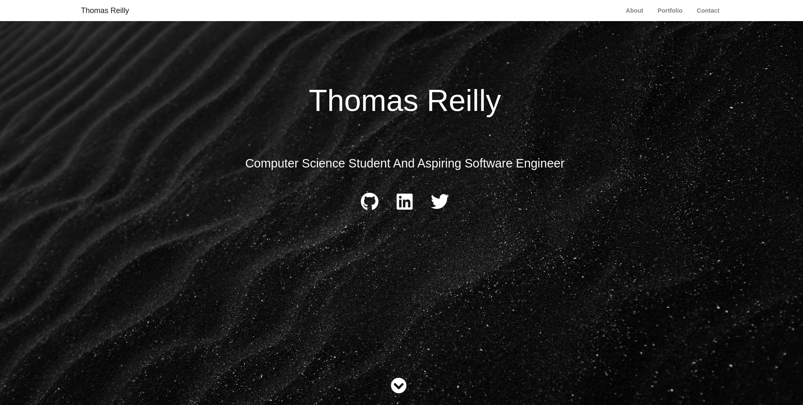

# Project Portfolio Website
A React App built to serve a single page website showing a simple resume and portfolio. The data that appears on the webpage can easily be changed and updated with the src/config.js file. With little effort you can make this website your own and easily update it with data over time. More on how to do this can be found below.


This webpage is live on [thomasreilly.tech](https://www.thomasreilly.tech), my personal website hosted on a raspberry pi .

## Pre-requisites
To run this website on your local machine you should have a stable version of [node.js](https://www.nodejs.org) and npm installed.

## Getting Started
To get started running this app on your local machine you should clone this repository into your desired location.
```
git clone https://github.com/thomasreilly1011/project-portfolio-website.git
```


Once cloned, navigate to the root of the project and install all of the required packages
```
npm install
```

You are now ready to run the server on your local host.
```
npm start
```
This should compie and serve up the app on your local host and open the webpage in your default web browser.

## Making the website your own
As mentioned, I have included a config.js file which holds a single json object called inputData. This holds all of the information displayed on the webpage. Here you can fill in the pre-defined fields with your own information.

For example, in the font page section of the object, you can replace the json fields with your own name, subtitle and social media urls.
```
"full_name":"Insert your full name here",
"sub_title":"Insert subtitle here",
"github_link":"Insert url to your Github page here",
"linked_in_link":"Insert url to your Linked In page here",
"twitter_link":"Insert url to your Twitter page here",
```

When you are finished, save the file and the webpage should update automatically.
## Author

Thomas Reilly - thomas.edreilly@gmail.com
